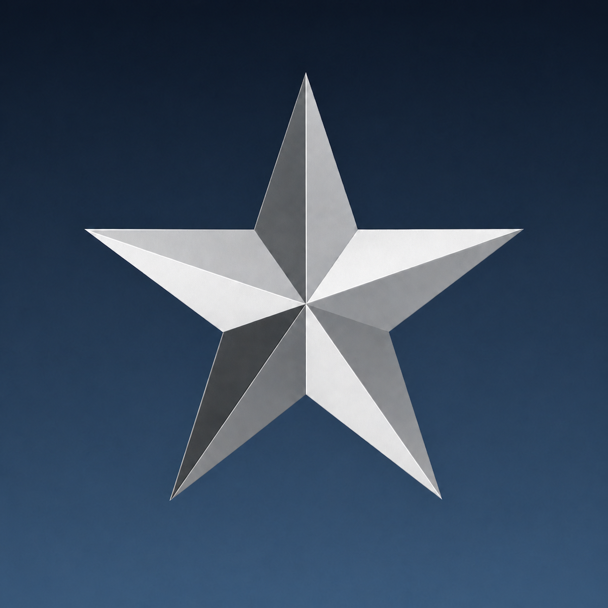

<p align="center">
  
</p>

<h1 align="center">Open CoD:UO</h1>

<p align="center">
  Reconstructed source for the <em>Call of Duty: United Offensive</em> multiplayer client and dedicated-server components.
</p>

This repository contains source and public build dependencies only. It does
not contain game data, binaries, private binary-analysis records, generated
decompiler output, or recovery ledgers.

See [the changelog](CHANGELOG.md) for a concise list of user-visible differences from the stock game.

## Branches

- `stock` is the hardened stock-compatible baseline. It preserves legitimate
  original behavior while carrying shared hardening and required platform,
  ABI, and compatibility support.
- `master` descends from `stock` and contains the improved product: intentional
  product changes, ordinary original-game bug fixes, features, and optional
  enhancements.

See [the branch policy](docs/branch-policy.md) for the exact boundary. Run
`make policy-check` before committing or releasing either branch.

## Layout

- `src/client/engine/`: multiplayer client executable.
- `src/client/cgame/`: client-game module.
- `src/client/ui/`: user-interface module.
- `src/server/standalone/`: dedicated-server process and platform boundaries.
- `src/server/engine/`: server engine shared with the client's listen server.
- `src/server/game/`: server game module.
- `src/`: common qcommon, math, BG, collision, filesystem, animation,
  scripting, sound, and compatibility subsystems.
- `build-mk/`: explicit source manifests and component build rules.
- `vendor/`: tracked third-party source required by the builds.

## Build

Choose the section for the platform where you are building. A legally owned
Call of Duty: United Offensive installation is needed to run the client, but
the retail game files are not part of the source build.

### macOS (Apple Silicon)

Install Apple's Command Line Tools (the full Xcode application also provides
them):

```sh
xcode-select --install
```

Install [Homebrew](https://brew.sh/) if it is not already available, then
install the remaining dependencies:

```sh
brew install pkgconf sdl2 jpeg-turbo minizip
```

`pkgconf` supplies the `pkg-config` command used by the Makefiles. The macOS
SDK supplies Clang, `make`, libcurl, zlib, and the required system frameworks.

Build the native client executable, cgame, and UI:

```sh
make
```

To create a Finder-launchable application bundle or a distributable ZIP:

```sh
make macos-app
make macos-zip
```

### Debian or Ubuntu Linux (x86-64)

Install the compiler and development packages:

```sh
sudo apt-get update
sudo apt-get install -y build-essential pkg-config libsdl2-dev libjpeg-dev \
  libcurl4-openssl-dev libminizip-dev zlib1g-dev libgl1-mesa-dev \
  libopenal-dev libsndfile1-dev
```

Build the native client executable, cgame, and UI:

```sh
make
```

To build a complete x86-64 client archive or the dedicated server and matching
game module:

```sh
make client-linux64-package
make server64
```

### Debian or Ubuntu Linux (32-bit on an x86-64 host)

Enable i386 packages and install the complete 32-bit toolchain and dependency
set:

```sh
sudo dpkg --add-architecture i386
sudo apt-get update
sudo apt-get install -y build-essential gcc-multilib g++-multilib pkg-config \
  libsdl2-dev:i386 libjpeg-dev:i386 libcurl4-openssl-dev:i386 \
  libminizip-dev:i386 zlib1g-dev:i386 libgl1-mesa-dev:i386 \
  libopenal-dev:i386 libsndfile1-dev:i386
```

Build the 32-bit client archive or dedicated server:

```sh
make client-linux32-package
make server32
```

### Windows

The Windows targets use GNU Make and GCC rather than Visual Studio. Install
[MSYS2](https://www.msys2.org/), update it with `pacman -Syu`, and reopen the
terminal if the update asks you to. Use the terminal matching the package you
want to build.

For a 64-bit build, open **MSYS2 MINGW64** and install the development tools:

```sh
pacman -S --needed git make zip mingw-w64-x86_64-toolchain
```

Build or install static x86-64 Windows libraries for SDL2, libjpeg-turbo,
libcurl, Minizip, and zlib under one prefix containing `include/` and `lib/`.
Then build the package from the source checkout:

```sh
make client-windows-x86_64-package \
  MINGW64_DEP_PREFIX=/c/path/to/x86_64-prefix
```

For a 32-bit build, open **MSYS2 MINGW32** and install the development tools:

```sh
pacman -S --needed git make zip mingw-w64-i686-toolchain
```

Build the same dependencies for i686 under a separate static prefix. The
32-bit client also uses `mss32.dll` from a legally owned retail installation.
Pass both MSYS2 paths when building:

```sh
make client-windows-i686-package \
  MSS32_DLL="/c/path/to/Call of Duty/mss32.dll" \
  MINGW32_DEP_PREFIX=/c/path/to/i686-prefix
```

### Windows cross-builds from Debian or Ubuntu Linux

Install the 32-bit and 64-bit MinGW-w64 compilers and packaging tools:

```sh
sudo apt-get update
sudo apt-get install -y build-essential mingw-w64 pkg-config zip
```

Both client builds require architecture-matched static builds of SDL2,
libjpeg-turbo, libcurl, Minizip, and zlib. Put each dependency set under a
prefix containing `include/` and `lib/`, then build either or both packages:

```sh
make client-windows-i686-package \
  MSS32_DLL=/path/to/retail/mss32.dll \
  MINGW32_DEP_PREFIX=/path/to/i686-prefix

make client-windows-x86_64-package \
  MINGW64_DEP_PREFIX=/path/to/x86_64-prefix
```

Generated build, package, and runtime files stay under `.workbench/`. Package
targets create complete architecture-matched archives without retail game
data. Use `make help` for additional build options.

To build and run the native client as the normal system game, point it at a
game-data root containing `main/` and `uo/`:

```sh
make client-run \
  CLIENT_DATA_PATH="/absolute/path/to/Call of Duty UO" \
  CLIENT_ARGS="+set r_fullscreen 1"
```

`client-run` uses the system's persistent OpenCoDUO profile, including normal
configuration, favorites, downloads, and screenshots. On macOS this is
`~/Library/Application Support/OpenCoDUO/`.

Automated and development tests must use the isolated launcher instead:

```sh
make client-test-run \
  CLIENT_DATA_PATH="/absolute/path/to/Call of Duty UO" \
  CLIENT_ARGS="+set r_fullscreen 0"
```

`client-test-run` always supplies an explicit `fs_homepath` below
`.workbench/runtime/`; it will refuse a runtime or home directory outside that
root. Agents must never use `client-run` for testing.

To launch an existing native build in isolation without rebuilding it, run the
following from the repository root:

```sh
CODUOMP_ROOT="$(pwd -P)"
mkdir -p "$CODUOMP_ROOT/.workbench/runtime/manual/home"
cd "$CODUOMP_ROOT/.workbench/runtime/manual"

"$CODUOMP_ROOT/.workbench/build/client/native/CoDUOMP" \
  +set fs_basepath "$CODUOMP_ROOT/.workbench/build/client/native" \
  +set fs_cdpath "/absolute/path/to/Call of Duty UO" \
  +set fs_homepath "$CODUOMP_ROOT/.workbench/runtime/manual/home"
```

`fs_basepath` locates the reconstructed native cgame and UI modules staged
under `.workbench/build/client/native/uo/`. `fs_cdpath` locates the game-data
`main/` and `uo/` directories. `fs_homepath` keeps generated configuration,
logs, downloads, and caches isolated from personal profiles.

On the `master` branch, see [client gamma control](docs/client-gamma.md) for
the selectable output-gamma policies and provider order.

See [per-server client configuration](docs/client-server-configs.md) for the
console commands that promote the current server profile to the global config
or clear every isolated server config while preserving downloaded content.

See [client build notes](docs/client-building.md),
[server build notes](docs/server-building.md), and
[the project boundary](docs/project-boundary.md) for platform details and
repository scope.

## Status

The goal is functional equivalence rather than a byte-identical rebuild.
Source reconstruction is complete, while validation and original-product bug
triage continue.
